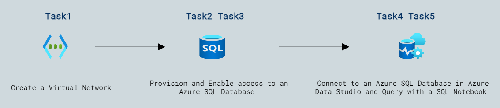

# Lab Scenario Preview: Lab02: Provision an Azure SQL Database

## Lab overview

Students will configure basic resources needed to deploy an Azure SQL Database with a Virtual Network Endpoint. Connectivity to the SQL Database will be validated using Azure Data Studio from the lab VM.

As a database administrator for AdventureWorks, you will set up a new SQL Database, including a Virtual Network Endpoint to increase and simplify the security of the deployment. Azure Data Studio will be used to evaluate the use of a SQL Notebook for data querying and results retention.

## Objectives

After completing this lab, you will be able to:

- Create a Virtual Network
- Provision an Azure SQL Database
- Enable access to an Azure SQL Database
- Connect to an Azure SQL Database in Azure Data Studio
- Query an Azure SQL Database with a SQL Notebook

## Architecture Diagram

Now that you know what the lab is going to be all about, you can launch next item **Hands-on Lab** which includes lab environment and lab guide. You can also preview the full lab guide [here](https://experience.cloudlabs.ai/#/labguidepreview/55d29fb7-c435-47f1-a25d-52cfd436567f) if you want to go through detailed guide prior to launching lab environment.  