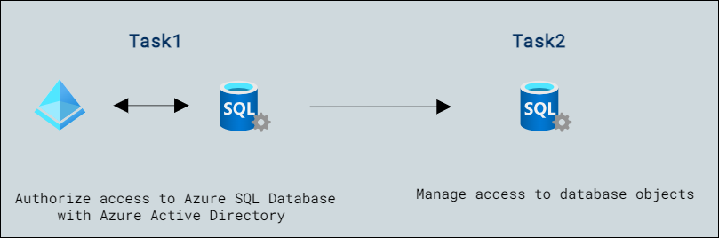

# Lab Scenario Preview: DP-300:Implement a secure environment for a database service 

## Lab03: Configure database authentication and authorization

### Lab overview

The students will take the information gained in the lessons to configure and subsequently implement security in the Azure Portal and within the AdventureWorks database.

You've been hired as a Senior Database Administrator to help ensure the security of the database environment.

## Objectives

After completing this lab, you will be able to:

- Authorize access to Azure SQL Database with Azure Active Directory
- Manage access to database objects

## Architecture Diagram

Now that you know what the lab is going to be all about, you can launch next item **Hands-on Lab** which includes lab environment and lab guide. You can also preview the full lab guide [here](https://experience.cloudlabs.ai/#/labguidepreview/7ee8c2a0-31c1-4350-95c5-96c387f2eb99) if you want to go through detailed guide prior to launching lab environment.  