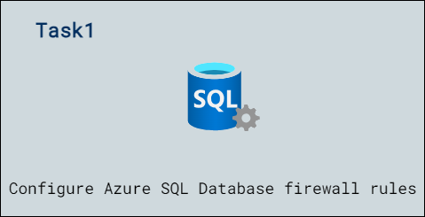

# Lab Scenario Preview: DP-300: Implement a secure environment for a database service 

## Lab04: Implement a Secure Environment

### Lab overview

The students will take the information gained in the lessons to configure and subsequently implement security in the Azure Portal and within the AdventureWorks database.

You have been hired as a Senior Database Administrator to help ensure the security of the database environment. These tasks will focus on Azure SQL Database.

## Objectives

After completing this lab, you will be able to:

- Configure Azure SQL Database firewall rules

## Architecture Diagram

Now that you know what the lab is going to be all about, you can launch next item **Hands-on Lab** which includes lab environment and lab guide. You can also preview the full lab guide [here](https://experience.cloudlabs.ai/#/labguidepreview/00068343-31b8-4f27-8350-b596bf6570b1) if you want to go through detailed guide prior to launching lab environment.  