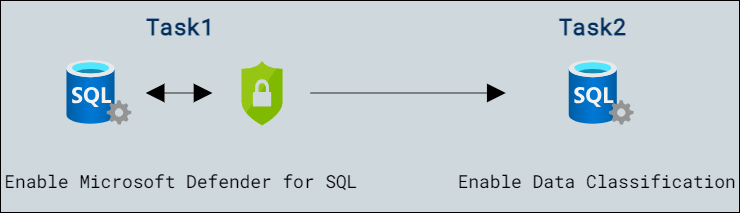

# Lab Scenario Preview: Lab05: Enable Microsoft Defender for SQL and Data Classification

## Lab overview

The students will take the information gained in the lessons to configure and subsequently implement security in the Azure Portal and within the AdventureWorks database.

You have been hired as a Senior Database Administrator help ensure the security of the database environment. These tasks will focus on Azure SQL Database.

## Objectives

After completing this lab, you will be able to:

- Enable Microsoft Defender for SQL
- Enable Data Classification

## Architecture Diagram

Once you understand the lab's content, you can start the Hands-on Lab by clicking the **Launch** button located in the top right corner. This will lead you to the lab environment and guide. You can also preview the full lab guide [here](https://experience.cloudlabs.ai/#/labguidepreview/ffeaaa6f-553e-40d1-9180-5104c15624af) if you want to go through a detailed guide prior to launching the lab environment. 
 