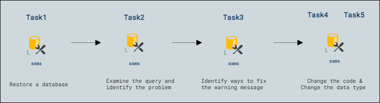

# Lab Scenario Preview: DP-300:  Optimize query performance in Azure SQL 

## Lab09: Identify database design issues

### Lab overview

The students will take the information gained in the lessons to scope out the deliverables for a digital transformation project within AdventureWorks. Examining the Azure portal as well as other tools, students will determine how to utilize native tools to identify and resolve performance related issues. Finally, students will be able to evaluate a database design for problems with normalization, data type selection, and index design.

You have been hired as a database administrator to identify performance related issues and provide viable solutions to resolve any issues found. AdventureWorks has been selling bicycles and bicycle parts directly to consumers and distributors for over a decade. Your job is to identify issues in query performance and remedy them using techniques learned in this module.

## Objectives

After completing this lab, you will be able to:

- Restore a database
- Examine the query and identify the problem
- Identify ways to fix the warning message
- Change the code
- Change the data type

## Architecture Diagram

Now that you know what the lab is going to be all about, you can launch next item **Hands-on Lab** which includes lab environment and lab guide. You can also preview the full lab guide [here](https://experience.cloudlabs.ai/#/labguidepreview/16af0420-01ef-40fc-b620-a5242c9c0bd4) if you want to go through detailed guide prior to launching lab environment.  