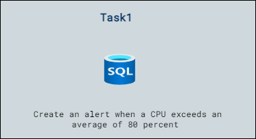

# Lab Scenario Preview: Lab12: Create a CPU status alert for a SQL Server on Azure

## Lab overview

You have been hired as a Senior Data Engineer to help automate day to day operations of database administration. This automation is to help ensure that the databases for AdventureWorks continue to operate at peak performance as well as provide methods for alerting based on certain criteria.

## Objectives

After completing this lab, you will be able to:

- Create an alert when a CPU exceeds an average of 80 percent

## Architecture Diagram

Now that you know what the lab is going to be all about, you can launch next item **Hands-on Lab** which includes lab environment and lab guide. You can also preview the full lab guide [here](https://experience.cloudlabs.ai/#/labguidepreview/ff14f7fa-fddb-4bd6-9680-285b650db733) if you want to go through detailed guide prior to launching lab environment.  