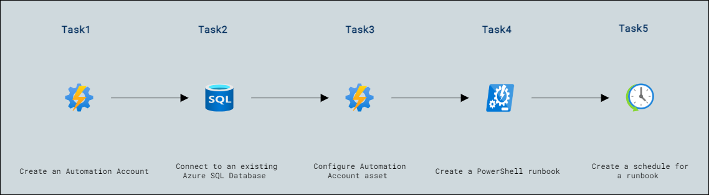

# Lab Scenario Preview: Lab13: Deploy an automation runbook to automatically rebuild indexes

## Lab overview

You have been hired as a Senior Database Administrator to help automate day to day operations of database administration. This automation is to help ensure that the databases for AdventureWorks continue to operate at peak performance as well as provide methods for alerting based on certain criteria. AdventureWorks utilizes SQL Server in both Infrastructure as a Service (IaaS) and Platform as a Service (PaaS) offerings.

## Objectives

After completing this lab, you will be able to:

- Create an Automation Account
- Connect to an existing Azure SQL Database
- Configure Automation Account asset
- Create a PowerShell runbook
- Create a schedule for a runbook

## Architecture Diagram

Now that you know what the lab is going to be all about, you can launch next item **Hands-on Lab** which includes lab environment and lab guide. You can also preview the full lab guide [here](https://experience.cloudlabs.ai/#/labguidepreview/f5a9b8ea-a7fb-4c8b-b6f3-a151461a9e29) if you want to go through detailed guide prior to launching lab environment.  