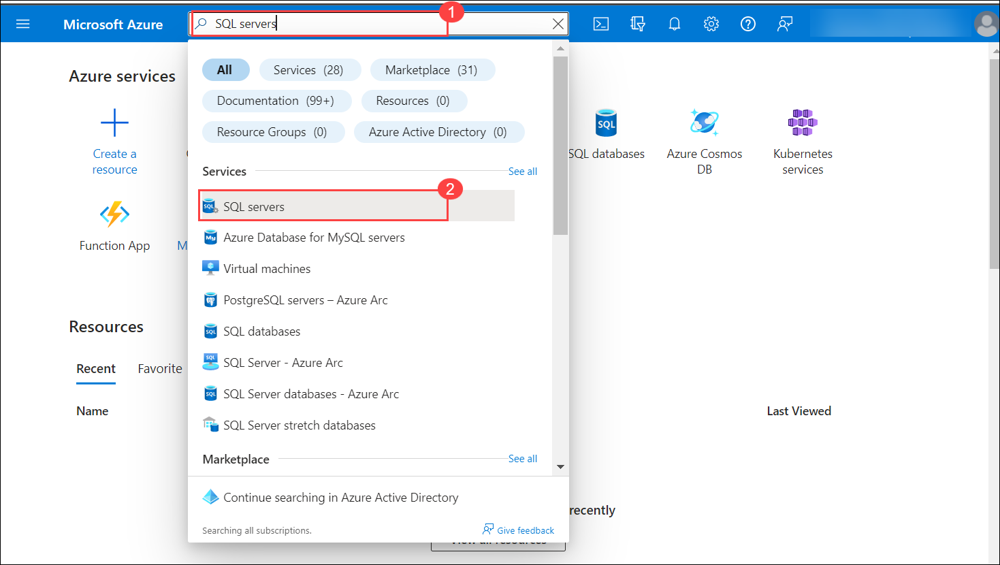
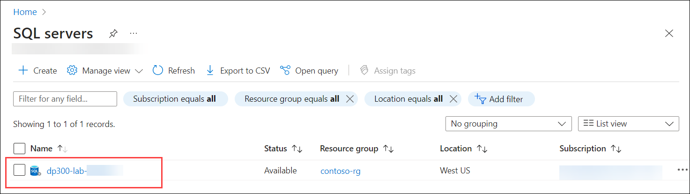
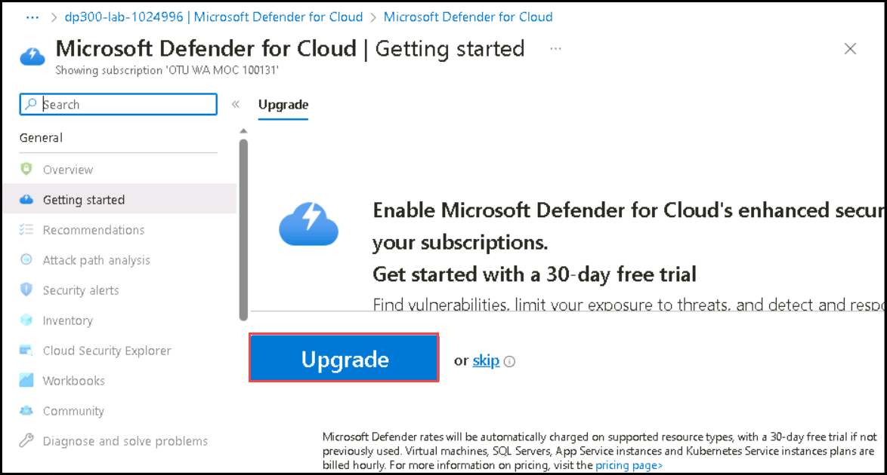
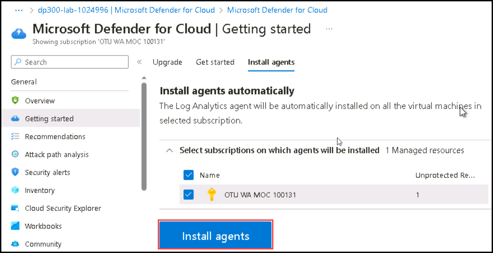
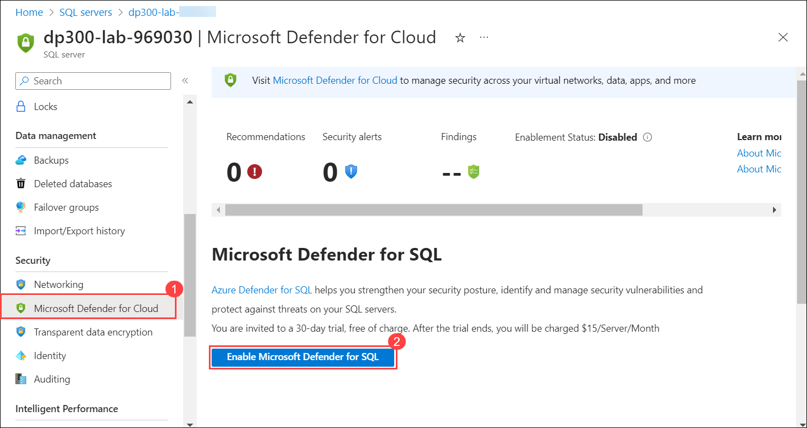
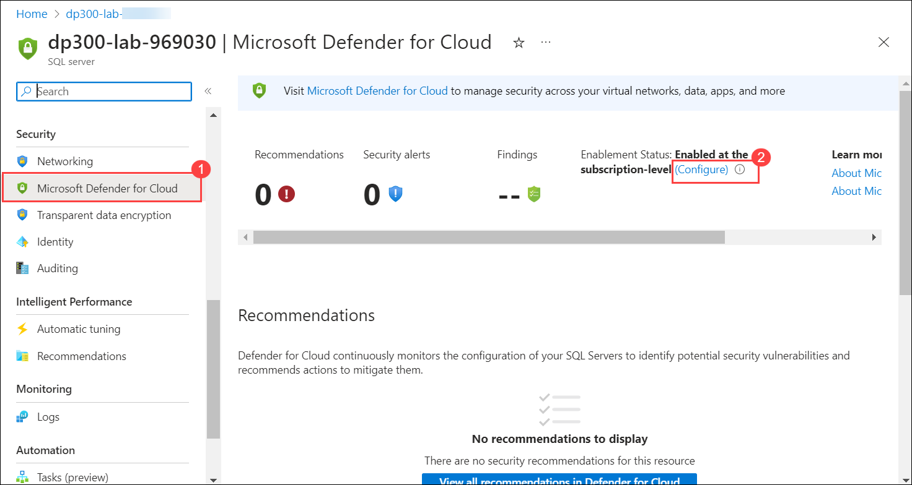
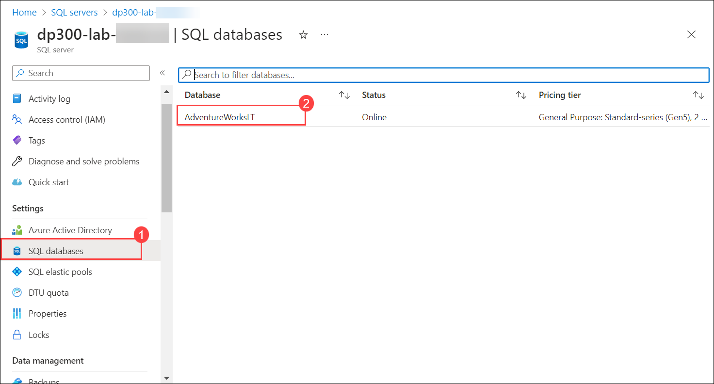
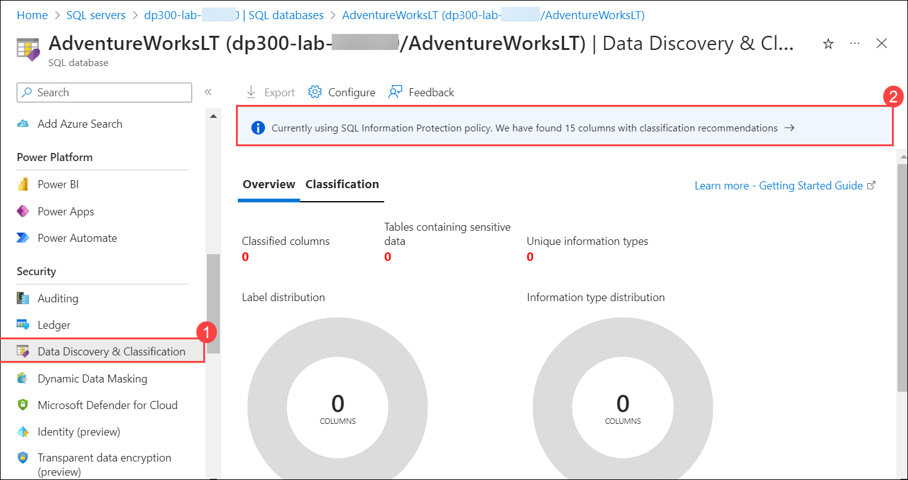
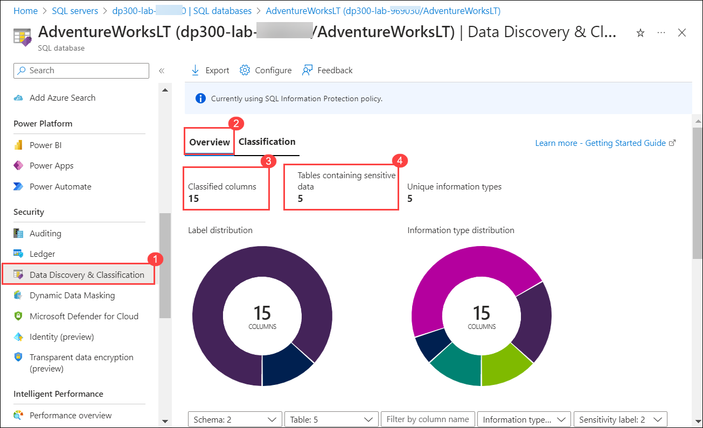

# Lab 05: Enable Microsoft Defender for SQL and Data Classification

The students will take the information gained in the lessons to configure and subsequently implement security in the Azure Portal and within the AdventureWorks database.

You have been hired as a Senior Database Administrator help ensure the security of the database environment. These tasks will focus on Azure SQL Database.

## Lab objectives

In this lab, you will complete the following tasks:

- Task 1: Enable Microsoft Defender for SQL
- Task 2: Enable Data Classification

## Estimated timing: 30 minutes

## Architecture diagram

.png)

### Task 1 - Enable Microsoft Defender for SQL

1. From the Azure Portal, search for “SQL servers” in the search box at the top, then click on **SQL servers** from the list of options.

    

1. Select the server name **dp300-lab-<inject key="DeploymentID" enableCopy="false"/>** to be taken to the detail page (you may have a different location assigned for your SQL server).

    

1. From the main blade of your Azure SQL server, navigate to the **Security** section, and select **Microsoft Defender for Cloud**.

1. On the **Microsoft Defender for Cloud (1)** page, select **Upgrade**, then navigate to the Install Agents blade and select **Install Agent**.

   

   

1. On the **Microsoft Defender for Cloud (1)** page, select **Enable Microsoft Defender for SQL (2)**.

       

1. The following notification message will show up after Azure Defender for SQL is successfully enabled.

    

1. On the **Microsoft Defender for Cloud (1)** page, select the **Configure (2)** link (You may need to refresh the page to see this option)

    

1. On the **Server settings** page, notice that toggle switch under **MICROSOFT DEFENDER FOR SQL** is set to **ON**.

    
> **Congratulations** on completing the task! Now, it's time to validate it. Here are the steps:
- Click the Lab Validation tab located at the upper right corner of the lab guide section and navigate to the Lab Validation Page.
- Hit the Validate button for the corresponding task. If you receive a success message, you can proceed to the next task. 
- If not, carefully read the error message and retry the step, following the instructions in the lab guide.
- If you need any assistance, please contact us at labs-support@spektrasystems.com. We are available 24/7 to help you out.
  
### Task 2 - Enable Data Classification

1. From the main blade of your Azure SQL server, navigate to the **Settings** section, and select **SQL databases (1)**, and then select the database name **(2)**.

    

1. On the main blade for the **AdventureWorksLT** database, from left navigation pane select **Data Discovery & Classification** under **Security** section.
  
1. On the **Data Discovery & Classification** page, you will see an informational message that reads: **Currently using SQL Information Protection policy. We have found 15 columns with classification recommendations**. Select this link.

      
      
1. On the next **Data Discovery & Classification (1)** screen select the check box next to **Select all (2)**, select **Accepted selected recommendations(3)**, and then select **Save (4)** to save the classifications into the database.

    .png)
    
1. Back to the **Data Discovery & Classification (1)** screen, select **Overview (2)** tab notice that fifteen columns were successfully classified across five different tables.

    

>**Results:** In this exercise, you've enhanced the security of an Azure SQL Database by enabling Microsoft Defender for SQL. You've also created classified columns based on Azure portal recommendations.

## Review

In this lab, you have:

- Enabled Microsoft Defender for SQL.
- Enabled Data Classification.
  
## You have successfully completed the lab.

