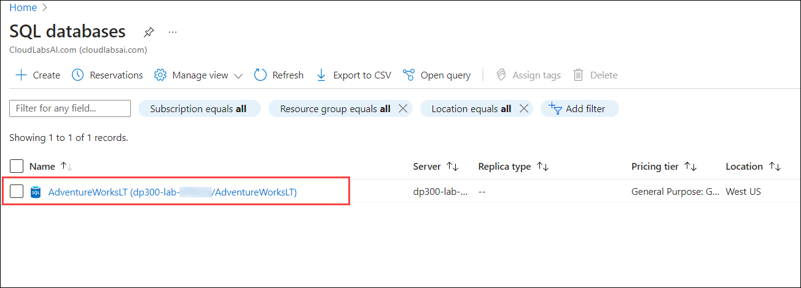
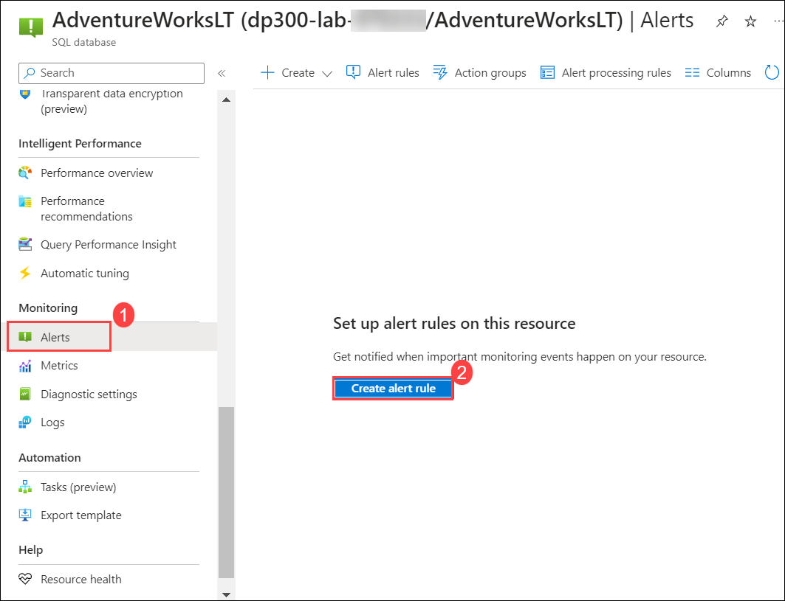
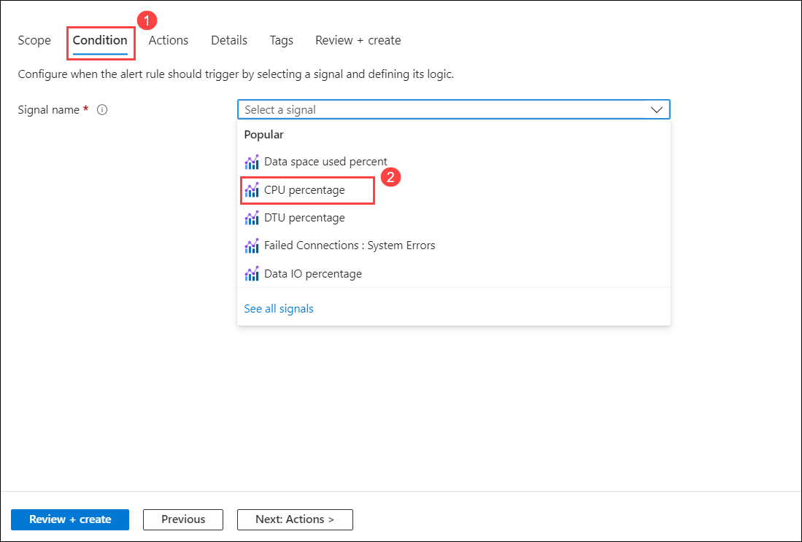
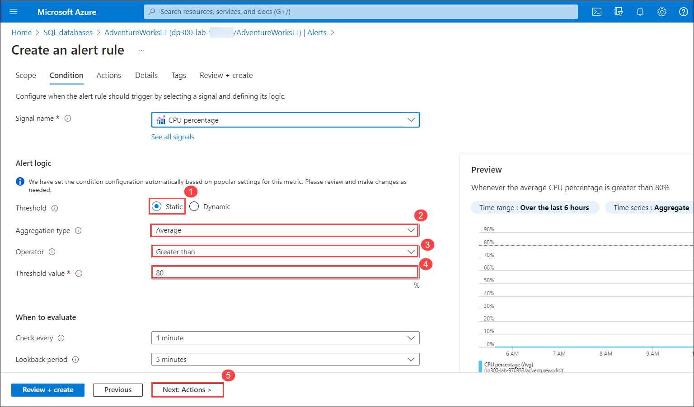
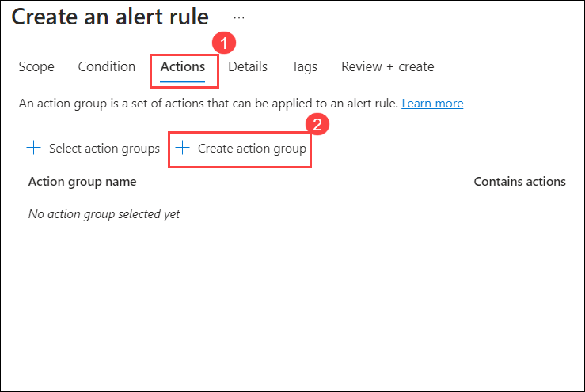
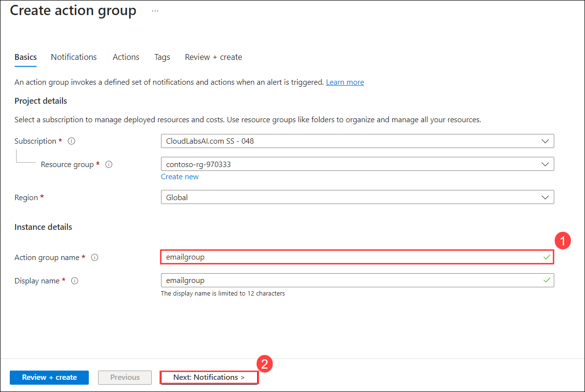
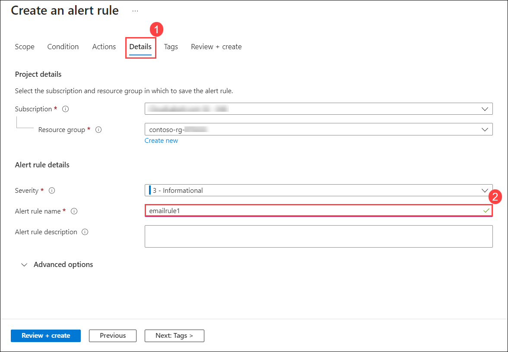
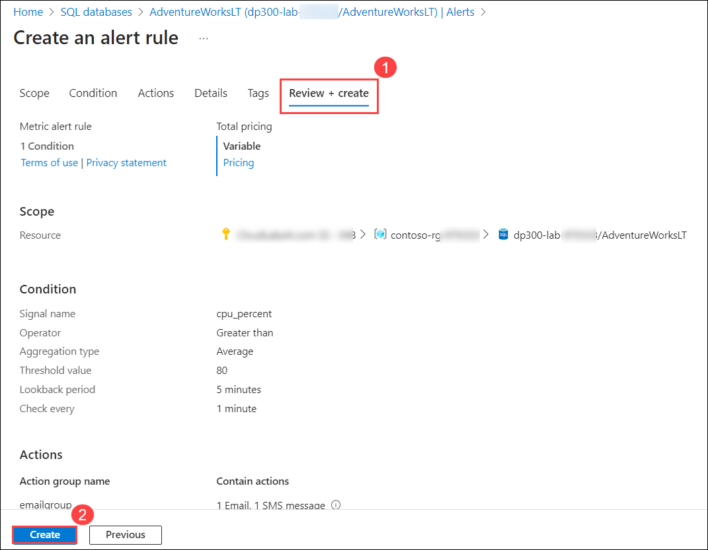
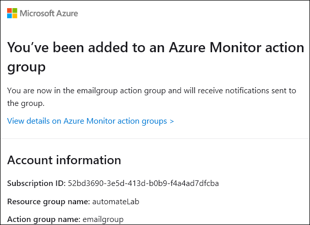
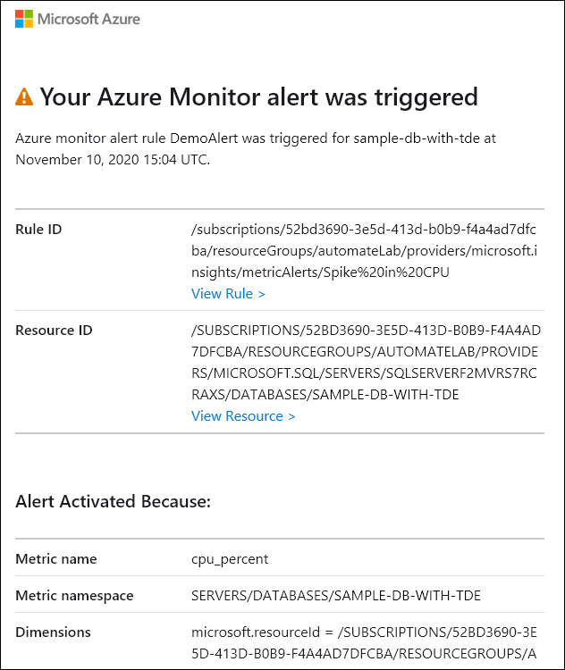

# Lab12: Create a CPU status alert for a SQL Server on Azure

You have been hired as a Senior Data Engineer to help automate day to day operations of database administration. This automation is to help ensure that the databases for AdventureWorks continue to operate at peak performance as well as provide methods for alerting based on certain criteria.

## Task 1 - Create an alert when a CPU exceeds an average of 80 percent

1. In the search bar at the top of the Azure portal, type **SQL database (1)** and select **SQL databases (2)**. 

    
 
3. Select the **AdventureWorksLT** database name listed.

   

2. On the main blade for the **AdventureWorksLT** database, navigate down to the monitoring section. Select **Alerts (1)**.Select **Create alert rule (2)**.

   

3. In the **Select a signal**, select **CPU percentage** from the drop-down.

   

4. In the **Create an alert rule** slide out, select **Static (1)** for the **Threshold** property. Then check that the **Aggregation** type is **Average (2)**, the **Operator** property is **Greater than (3)** Then in **Threshold value** enter a value of **80 (4)**. Select **Next:Actions (5)**.

    

5. In the **Actions (1)** tab, select **Create action group (2)**.

    

6. On the **Create action group** screen, type **emailgroup (1)** in the **Action group name** field, and then select **Next: Notifications (2)**.

    

7. On the **Notifications (1)** tab, enter the following information:

    - **Notification type:** Email/SMS message/Push/Voice **(2)**
       > **Note:** When you select this option, a Email/SMS message/Push/Voice flyout will appear. Check the Email **(3)** property and type the proper email address **(4)**, you can also use your personal email so that you can receive the notifications as shown in the last steps, Check the SMS **(5)** enter your country code **(6)** and your phone number **(7)**.
     - Click on **OK (8)**
    - **Name:** DemoLab (9)
    - Select **Review + create**, then select **Create**.
        >**Note:** Wait till action group created successfully then move to next step.

      
    
8. On the **Create an alert rule** screen, select **Details (1)** tab, enter Alert rule name as **emailrule (2)**, then select **Review + create**.
    
    

9. On the **Review + create (1)** tab, Select **Create (2)**.

    
    
10. An email like this is sent to the email address that you entered, once the rule is created.

    

    With the alert in place, if the CPU usage on average exceeds 80%, an email like this is sent.

    
    
   
    > **Congratulations** on completing the task! Now, it's time to validate it. Here are the steps:
    > - Click Lab Validation tab located at the upper right corner of the lab guide section and navigate to the Lab Validation Page.
    > - Hit the Validate button for the corresponding task.
    > - If you receive a success message, you can proceed to the next task. If not, carefully read the error message and retry the step, following the instructions in the lab guide.
    > - If you need any assistance, please contact us at labs-support@spektrasystems.com. We are available 24/7 to help you out.
  

Alerts can send you an email or call a web hook when some metric (for example database size or CPU usage) reaches a threshold you define. You've just seen how you can easily configure alerts for Azure SQL Databases.
