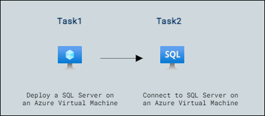

# Lab Scenario Preview: Lab01: Provision a SQL Server on an Azure Virtual Machine 

## Lab overview

Students will explore the Azure Portal and use it to create an Azure VM with SQL Server 2019 installed. Then they will connect to the virtual machine through Remote Desktop Protocol.

You are a database administrator for AdventureWorks. You need to create a test environment for use in a proof of concept. The proof of concept will use SQL Server on an Azure Virtual Machine and a backup of the AdventureWorksDW database. You need to set up the Virtual Machine, restore the database, and query it to ensure it is available.

## Lab objectives

In this lab, you will complete the following tasks:

- Deploy a SQL Server on an Azure Virtual Machine
- Connect to SQL Server on an Azure Virtual Machine

## Architecture Diagram

Once you understand the lab's content, you can start the Hands-on Lab by clicking the **Launch** button located in the top right corner. This will lead you to the lab environment and guide. You can also preview the full lab guide [here](https://experience.cloudlabs.ai/#/labguidepreview/b5841033-8b2d-41ca-aee9-068dab3fc8a9) if you want to go through a detailed guide prior to launching the lab environment. 
