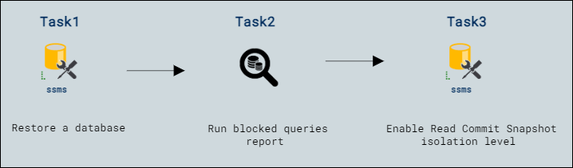

# Lab Scenario Preview: Lab08: Identify and resolve blocking issues 

## Lab overview

The students will take the information gained in the lessons to scope out the deliverables for a digital transformation project within AdventureWorks. Examining the Azure portal as well as other tools, students will determine how to utilize native tools to identify and resolve performance related issues. Finally, students will be able to identify and resolve blocking issues appropriately.

You have been hired as a database administrator to identify performance related issues and provide viable solutions to resolve any issues found. You need to investigate the performance problems and suggest methods to resolve them.

## Objectives

After completing this lab, you will be able to:

- Restore a database
- Run blocked queries report
- Enable Read Commit Snapshot isolation level

## Architecture Diagram

Once you understand the lab's content, you can start the Hands-on Lab by clicking the **Launch** button located in the top right corner. This will lead you to the lab environment and guide. You can also preview the full lab guide [here](https://experience.cloudlabs.ai/#/labguidepreview/cd32a22b-d7b7-4e1d-8eba-4ad1fbaa6d68) if you want to go through a detailed guide prior to launching the lab environment. 
