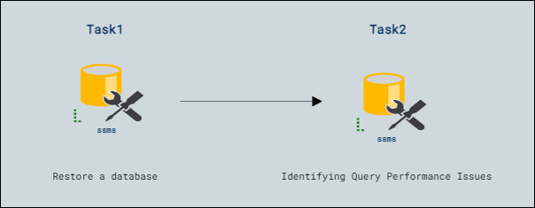

# Lab Scenario Preview: Lab10: Isolate problem areas in poorly performing queries in a SQL Database

## Lab overview

You've been hired as a Senior Database Administrator to help with performance issues currently happening when users query the AdventureWorks2017 database. Your job is to identify issues in query performance and remedy them using techniques learned in this module.

You'll run queries with suboptimal performance, examine the query plans, and attempt to make improvements within the database.

## Lab objectives

In this lab, you will complete the following tasks:

- Restore a database
- Identifying Query Performance Issues

## Architecture Diagram

Once you understand the lab's content, you can start the Hands-on Lab by clicking the **Launch** button located in the top right corner. This will lead you to the lab environment and guide. You can also preview the full lab guide [here](https://experience.cloudlabs.ai/#/labguidepreview/57834c0b-1a1b-4551-a97f-aa22429a4403) if you want to go through a detailed guide prior to launching the lab environment.  
