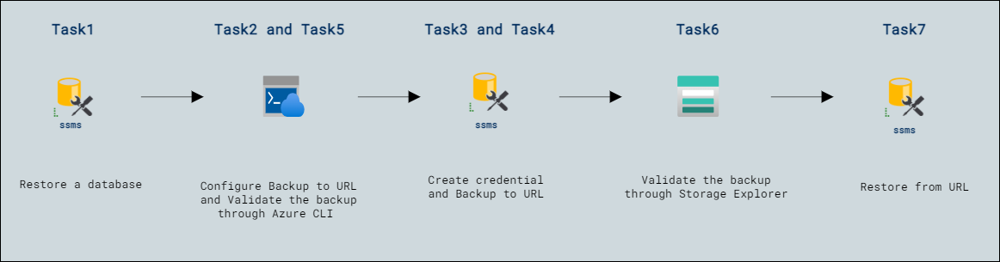

# Lab Scenario Preview: Lab15: Backup to URL

## Lab overview

As a Database Administrator for AdventureWorks, you need to back up a database to a URL in Azure and restore it from Azure blob storage after a human error has occurred.

## Lab objectives

In this lab, you will complete the following tasks:

- Restore a database
- Configure Backup to URL
- Create credential
- Backup to URL
- Validate the backup through Azure CLI
- Validate the backup through Storage Explorer
- Restore from URL

## Architecture Diagram

Once you understand the lab's content, you can start the Hands-on Lab by clicking the **Launch** button located in the top right corner. This will lead you to the lab environment and guide. You can also preview the full lab guide [here](https://experience.cloudlabs.ai/#/labguidepreview/21bdbb7e-67d7-4d9b-b852-cc942922465f) if you want to go through a detailed guide prior to launching the lab environment. 
