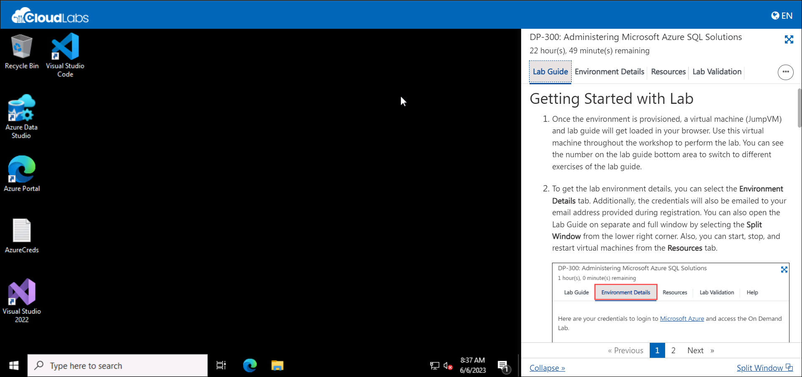
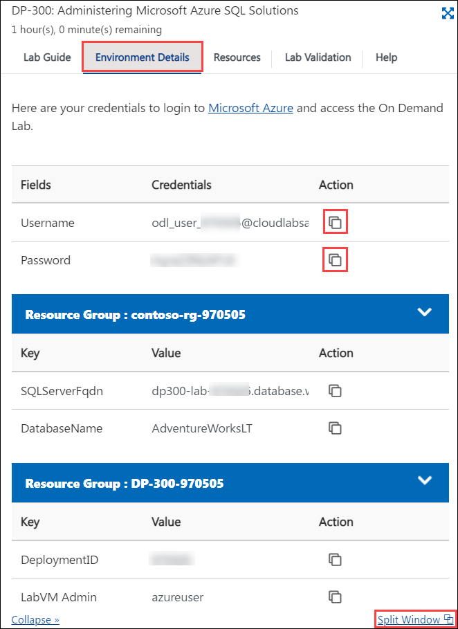

# Getting Started with Lab

1. Once the environment is provisioned, a virtual machine (JumpVM) and lab guide will get loaded in your browser. Use this virtual machine throughout the workshop to perform the lab. You can see the number on the lab guide bottom area to switch to different exercises of the lab guide.

   

1. To get the lab environment details, you can select the **Environment Details** tab. Additionally, the credentials will also be emailed to your email address provided during registration. You can also open the Lab Guide on separate and full window by selecting the **Split Window** from the lower right corner. Also, you can start, stop, and restart virtual machines from the **Resources** tab.

   

1. Use **Next** button from lower right corner to move on to the next page.

   

